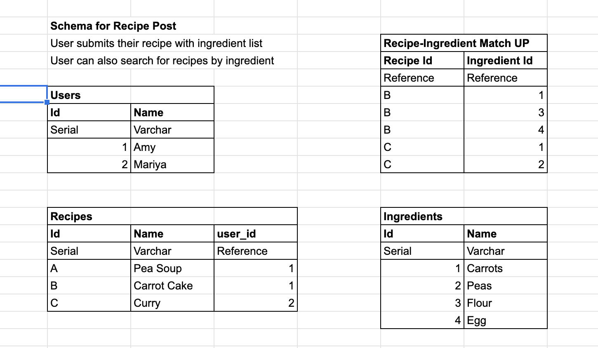

# Week 5 Database Week: Recipe Website

Visit us here: scam-recipe-app.herokuapp.com/

## Concept for Website

A recipe website where users can submit new recipes and search for recipes by ingredient.

### Acceptance Criteria 
- A form for users to submit data
- A page showing all the data
- Semantic form elements with correctly associated labels
- A Postgres database hosted on Heroku
- A schema describing your database in your README
- Tests for server routes and database access
- Not process user input as SQL commands
- Hidden environment variables (i.e. not on GitHub)
#### Stretch criteria 
- A way to view filtered/sorted data, instead of just all of it
- GitHub Actions CI setup to run your tests when you push

## Research & Roles
**S**aki: Relational Vs Non Relational Database / Facilitator
**C**hisha: Database Security / Deployment
**A**my: Schemes and Relationships / Quality
**M**ariya: Continuous Integration / User

## Schema

## Work Process
1. Split up Roles
2. Decide on Idea
3. Quickly sketched out the schema/tables on sheets/excel
4. Deployment set up: Installed npm, cypress, pg, express etc. 
5. Deployed to Heroku 
6. Split into Pairs for Route Handlers (Homepage and Addrecipess)